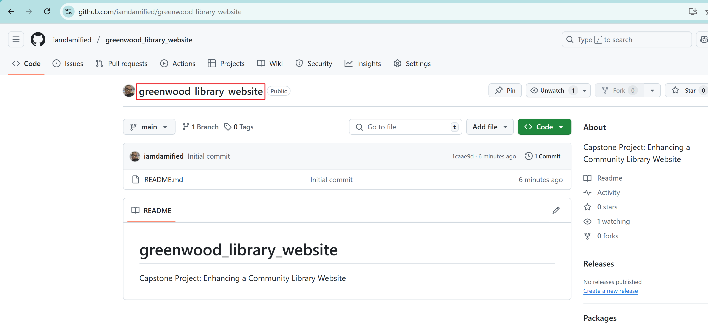
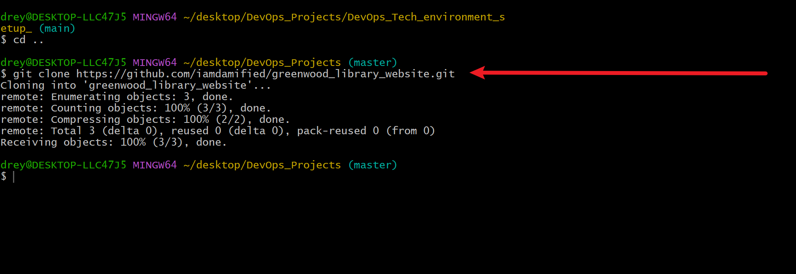
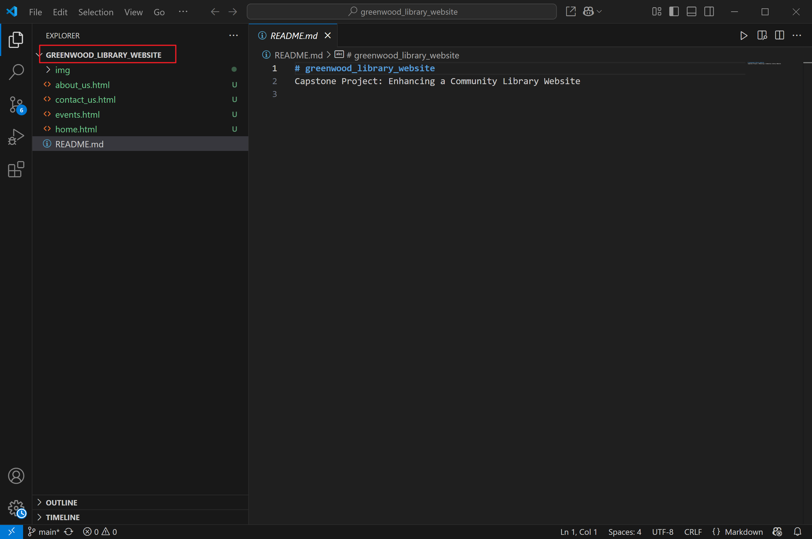
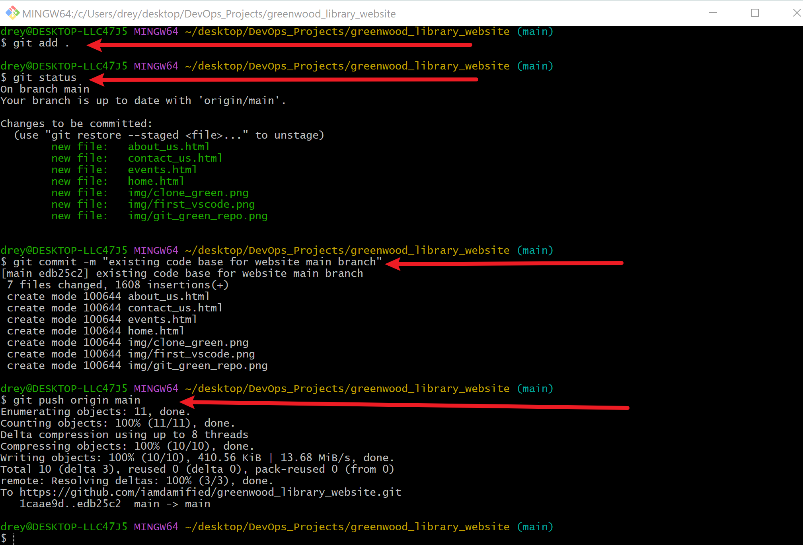

# greenwood_library_website
Capstone Project: Enhancing a Community Library Website

## Created New Git Repo on Github: greenwood_library_website

- _**Copied**_ the url to be cloned

## Cloned The Main Repo Into Local Repo

- Command: _**git**_

## Created Project html files into the local repo on Vscode.

## Staged, Committed and Pushed the html files to the main repo

- Command: _**git add .**_
- Command: _**git add .**_

## Pull the updated main branch into the local repo.

- Command: _**git pull origin main .**_

