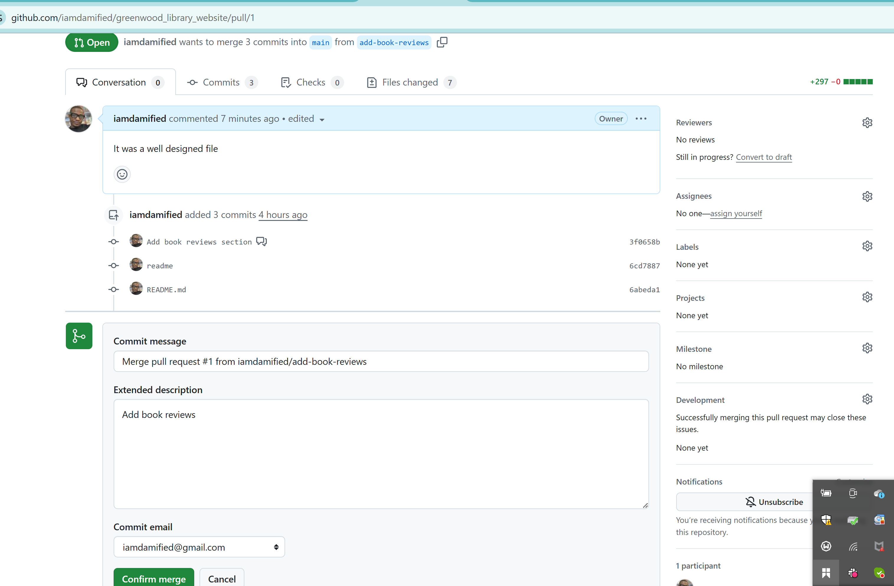

# greenwood_library_website
Capstone Project: Enhancing a Community Library Website

## Created New Git Repo on Github: greenwood_library_website

- _**Copied**_ the url to be cloned

## Cloned The Main Repo Into Local Repo in the Terminal

- Command: _**git clone https://github.com/iamdamified/greenwood_library_website.git**_

## Created Project html files into the local repo on Vscode.

- Files added are: _**about_us.html, contact_us.html, events.html, home.html**_

## Staged, Committed and Pushed the html files for Project to the main repo

- Command: _**git add .**_
- Command: _**git commit -m "existing files for main project"**_
- Command: _**git push origin main**_

## Pull the updated main branch into the local repo.

- Command: _**git pull origin main**_ to ensure the remote and local are the same content.

## Created and Switched into branch "add-book-reviews" for Morgan's work and Pull Main branch into it.

- Command: _**git checkout -b add-book-reviews**_
- Command: _**git pull origin main**_

## Morgan's Addition of the Book Review Section on VSCODE to New Branch.

- Added the book_review.html file to add-book-reviews branch

## Created Pull Request : Staged, Commited, and Pushed book-reviews.html to add-book-reviews Branch

- Command: _**git add book_reviews.html**_
- Command: _**git commit -m "add book review section"**_
- Command: _**git push origin add-book-reviews**_

## Pull Request Created By Morgan was Opened for Review.

- The Project moderator must now review Morgan's work before merging.

## Opened and Reviewed Pull Request.

## Added Review Comment.

## Merged Pull Request.

## Confirm Merge Request.

## Merged Successfully.

## Updated Repo in Github for Jamie's Work to Begin With.

## Returned to Main Repo in terminal to pull updated Remote version.

## Created and Switched into New update-events Branch.

- Command: _**git checkout -b update-events**_ to switch to branch
- Command: _**git pull origin main**_ to pull contents of main repo
- Command: _**ls**_ to list files in repo branch
- Command: _**git add events.html**_ to stage file
- Command: _**git status**_ to know the status of staged file
- Command: _**git branch**_ to show the existing branches in repo

## Created a Pull Request for update-events Branch.

- Command: _**git commit -m "changes made in events.html"**_
- Command: _**git push origin update-events**_

## Creating Jamie's Pull Request on Github.

## Opening Jamie's Pull Request on Github.

## Merging Jamie's Pull Request on Github.

## Git branches

## Local Repo Branch Merging

- Command: _**git checkout main**_
- Command: _**git merge add-book-reviews**_
- Command: _**git merge update-events**_

